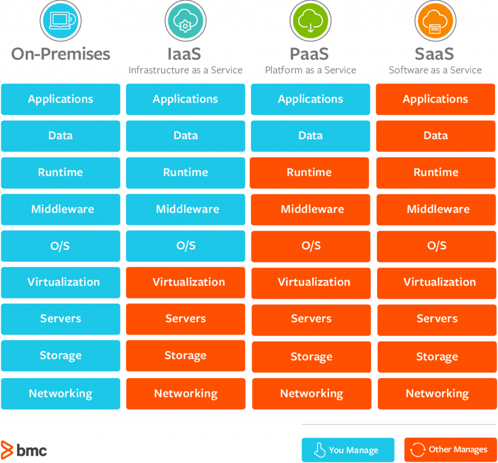
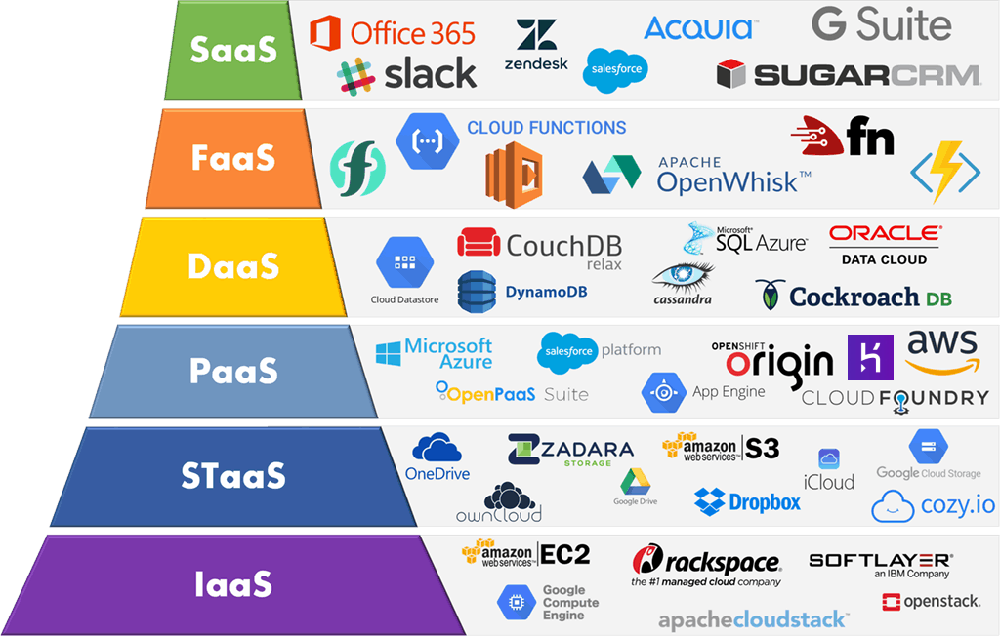
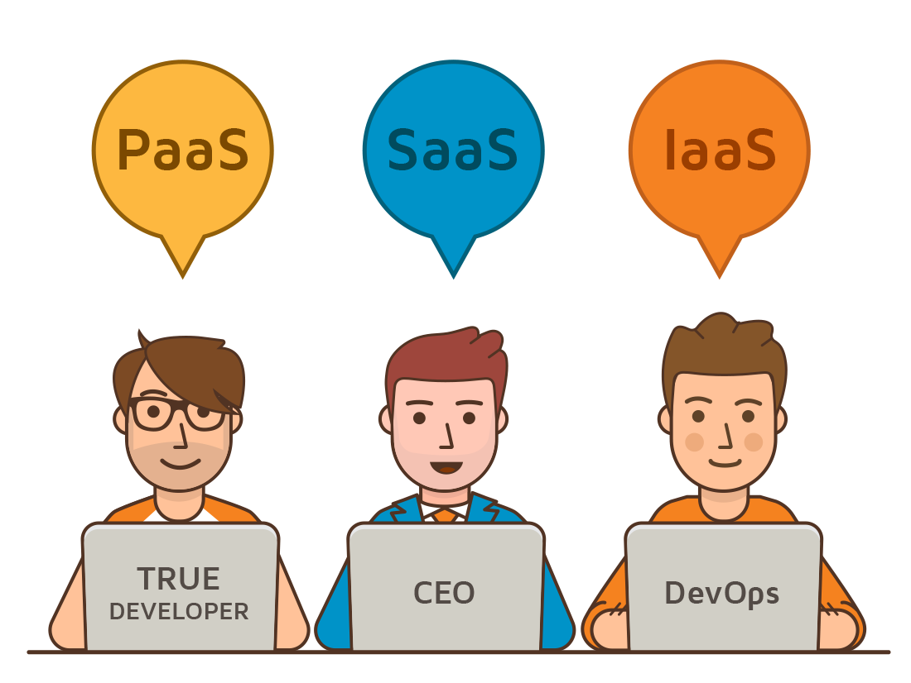
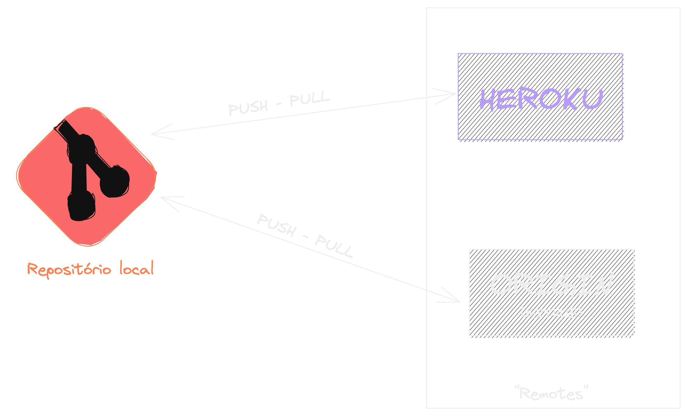
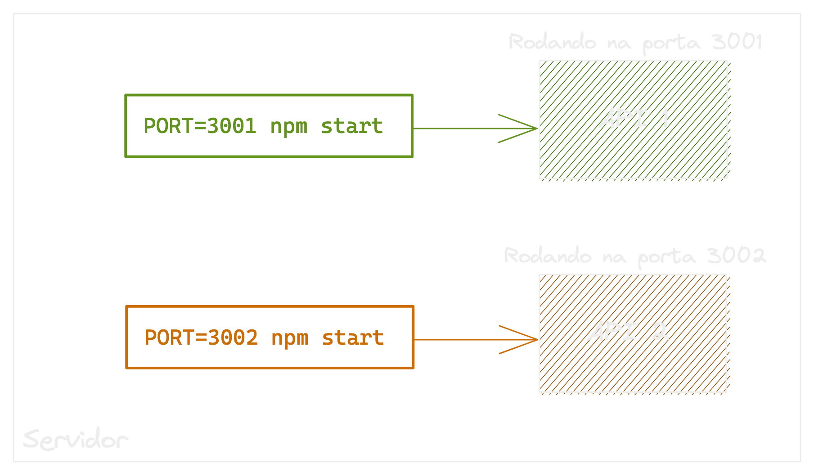
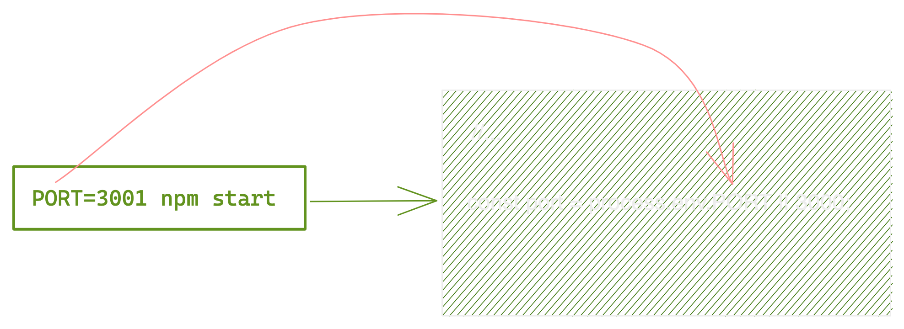
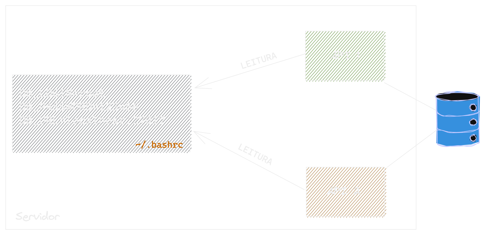
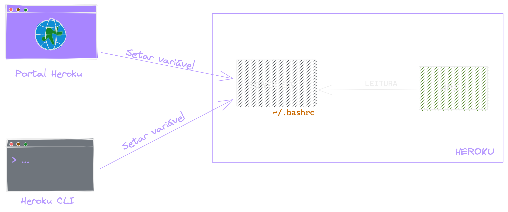
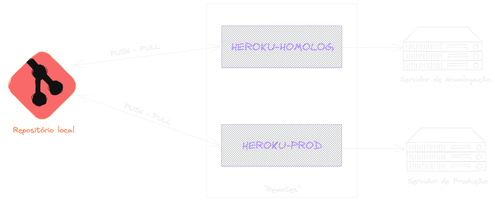
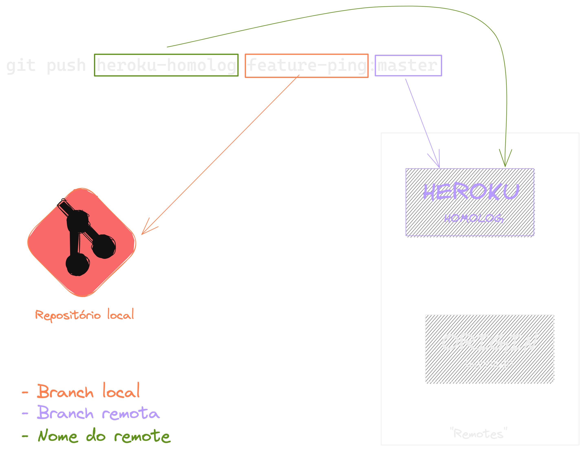

#### Deploy - Heroku

{width=80%}

---

### O que é deploy? 📦

{width=60%}

---

### E onde podemos fazer esses Deploys❓

---

{width=70%}

---

---

{width=80%}

---

#### Nosso foco hoje é no Heroku(PaaS)

---

#### Remotes - GIT

{width=85%}

---

### Variáveis de ambiente

---

### Variáveis de ambiente

---

### Variáveis de ambiente

---

### Variáveis de ambiente

---

#### Multi-ambientes

---

#### Remotes - GIT

{width=75%}

---

### Dúvidas?

{ width=90% }
