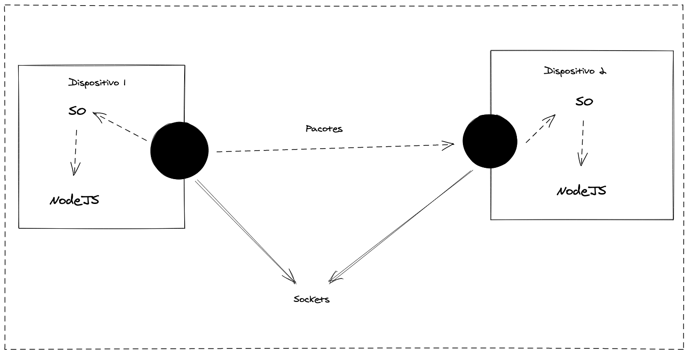
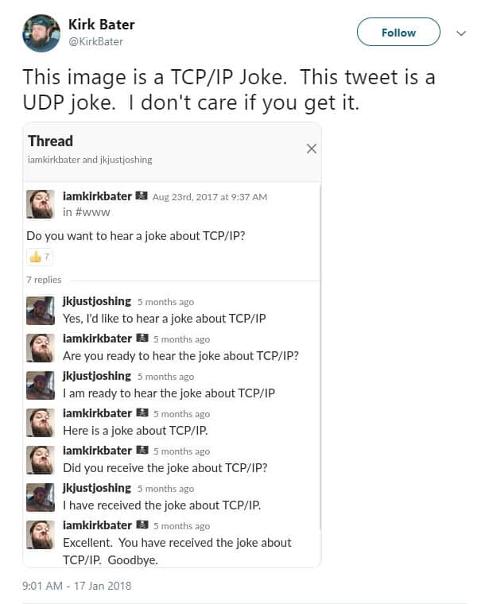
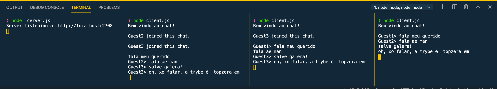

# TCP/UDP & NET

---

### Sockets

> "Um Socket é um ponto final (endpoint) de um canal bidirecional de comunicação entre dois programas rodando em uma rede;"

---

---

### TCP/UDP

* TCP e UDP são protocolos da camada 4 do Modelo OSI
* 65.536 portas TCP disponíveis
* 65.536 portas UDP disponíveis

---

---

### TCP

* Three Way Handshake (SYN, SYN-ACK, ACK)
* Verificação de integridade
* Reenvio de pacotes

---

### UDP

* Não garante a entrega
* Simplesmente envia o dado
* Ex: Pen Drives

---

### Pronto ou não aí vai um pacote! 

---

### Sockets TCP

* IP define a máquina.  
* Porta especifica a aplicação.
* Servidor fica em loop esperando requisições para gerar "sockets".

---

### Construindo um chat

---

### Chat

Let`s code!

---

### Dúvidas?

{ width=90% }
