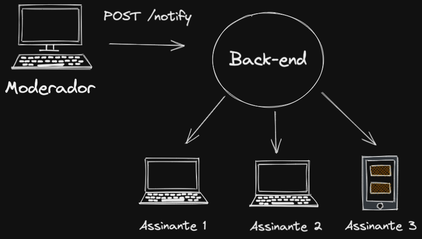
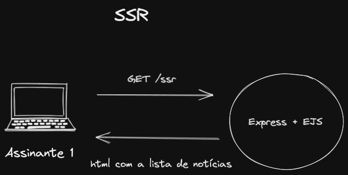
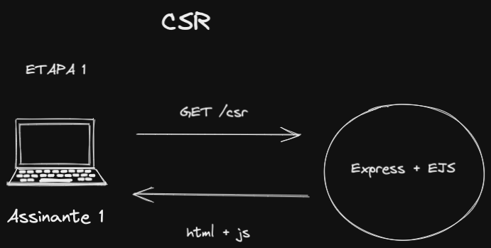
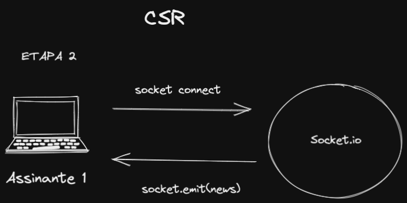

# Socket.io

---

### Setup do Socket.io 

```js
const socketIoServer = require('http').createServer();
const io = require('socket.io')(socketIoServer, {
  cors: { // Aqui existe um objeto de configuração, essas options são necessárias a partir da major 3 do socket.io 
    origin: `http://localhost:${PORT}`, // origem permitida
    methods: ['GET', 'POST'], // métodos permitidos
  },
});
```


---

### Quadro de notícias



---

### Implementando

Let`s code!

---

### E se precisarmos ao recarregar a página mostrar a lista de notícias já cadastradas?

---

### SSR



---

### CSR

Client-Side Rendering (Socket.io)



---

### CSR

Client-Side Rendering (Socket.io)



---

### Isso é tudo pessoal

Sextou!